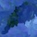
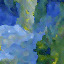

<p align="center">

<table>
<tr>
<td></td>
<td></td>
<td></td>
<td></td>
<td></td>
<td></td>
<td></td>
<td></td>
<td></td>
</tr>
</table>
</p>

Usage:

```
cargo run --release <width> <height> <input-image> [output-image]
```

Example:

```
cargo run --release 200 200 monet.jpg /tmp/out.png
```

Inspired by https://codegolf.stackexchange.com/a/22326.